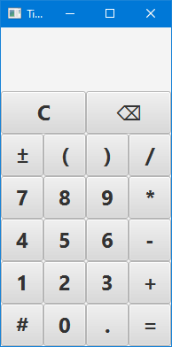

# Time Calculator

This is a simple command line tool and desktop application which performs calculations on times.
In English, the word "time" can refer to two distinct concepts. It can refer to a specific point in
time (e.g. "what time is it?") or it can refer to a duration between two points in time (e.g. "how
much time will it take?"). This calculator is for the second type.


## Use

### Operations and Syntax
The following table describes the supported operations.

| Left Operand | Operator(s) | Right Operand | Result |
|--------------|-------------|---------------|--------|
| Number       | +, -, \*, / | Number        | Number |
| Number       | \*          | Time          | Time   |
| Time         | \*, /       | Number        | Time   |
| Time         | +, -        | Time          | Time   |
| Time         | /           | Time          | Number |

Operations are evaluated in standard order. That is, multiplication and division, followed by
addition and subtraction, with operators of the same precedence evaluated left to right.
Additionally, parentheses can be used to group sub-expressions to override the normal order or
operations. No precendence is given to operations involving times versus numbers.

A time can be expressed in one of the following formats:
* *h*:*mm*:*ss*[.*sss*]
* *mm*:*ss*[.*sss*]
* *ss*[.*sss*]s

where
* *h* - represent a one or more digit hours component.
* *mm* - represents a two digit minutes component.
* *ss* - represents a two digit seconds component.
* [.*sss*] - represents an optional fractional seconds component, up to nanosecond precision.
* s - is the character `s`.
* : - is the character `:`.


### Command Line
To use the command line tool, simply provide a valid expression.
```
$ time-calc 9.8 + 7.6 - 5.4 * 3.2 / 1.1
1.690909091
$ time-calc 24:36 + 48s
25:24
$ time-calc 12:34:56 / 3
2:05:49.333333333
$ time-calc (55:55 / 2.5)
```

### Desktop Application

Values are automatically formatted as you type, so formatting characters such as `s` and `:` are not
necessary. By default, values are formatted as times, but you can toggle between times and numbers
clicking on the `#` key or typing `#` or `n`.



## Build

### Command Line Tool
The `core` module is written in [Rust](https://www.rust-lang.org/) and can be built using Cargo.

```
$ cd core
$ cargo build --release
```
It will produce the command line execuatable at `core/target/release/time-calc`.

The `core` module is also a [Java](https://jdk.java.net/) project which can be built using
[Maven](https://maven.apache.org/). It simply bundles the executable in a JAR so that it can be used
by the GUI. Currently, this method is only supported on Windows.
```
$ cd core
$ mvn package
```
The executable will be available at the same location, but a JAR file will also be built in the
`core/target/` directory.

### Desktop Application
The `gui` module is a [JavaFX](https://openjfx.io/) project which can be build using Maven.
Currently, only Windows builds are supported.

The simplest way to build it is to build the entire project.
```
$ mvn package
```

This will automatically build both the `core` and `gui` modules. The application will be built in
the `gui/target/time-calc/` directory. It can be launched by running the
`gui/target/time-calc/bin/time-calc.bat` script.

Alternatively, you can install the `core` module to your local Maven repository. Then as long as you
don't make any changes to the `core` module, you only need to re-build the `gui` module.
```
$ cd core
$ mvn install
$ cd ../gui
$ mvn package
```
